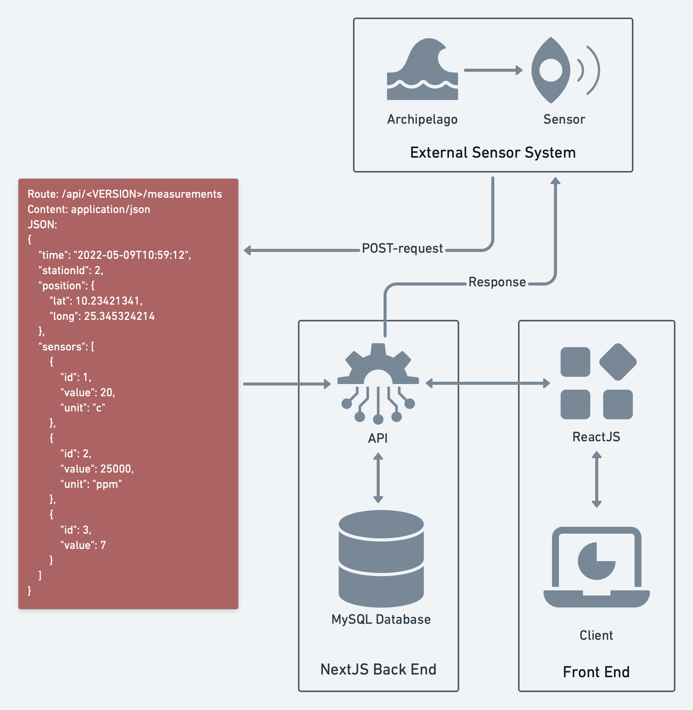

[](https://opensource.org/licenses/MIT)
[](https://github.com/sensor-network/open-data-portal/actions/workflows/integrate.yml)

# open-data-portal

Open Data Portal for Waterquality Sensor Data

## Introduction

TODO: Add brief introduction.

## Architecture Overview
The diagram shows the different parts of the system and how they interact with each other. The external sensor system can be found [here](https://github.com/sensor-network/sensor-collector).



## How to Use
This application can be built and run in two ways:

### Using Docker and Docker Compose (Packaged with a mySQL database)
#### Prerequisites
- [Docker](https://docker.com)
- [Docker Compose](https://docs.docker.com/compose/)

#### Build
If you want to build the application image yourself, you can

1. Clone the repo: 
```bash
$ git clone https://github.com/sensor-network/open-data-portal.git
$ cd open-data-portal
```
2. Build a local image: 
```bash
$ docker compose build app 
```

#### Run
You can now run the application using Docker Compose.
If you build the image locally, it will use the local image. Otherwise, it will pull the latest version from the registry.

```bash
$ docker compose up
```

The application will then start at `localhost:3000`

### From source
#### Prerequisites

- [Node.js 12.22.0](https://nodejs.org/en/) or later

#### Initial setup

1. Clone the repo:
```bash
$ git clone https://github.com/sensor-network/open-data-portal.git
$ cd open-data-portal
```
2. Install the project's dependencies:
```bash
$ npm install
```

3. Verify the credentials in `.env`. By default, it contains the credentials used to connect to the dockerized database supplied in this repo.

#### Build

Build an optimized production version of the app:
```bash
$ npm run build
```

#### Test

In order to run the tests, you need to start up the test database:
```bash
$ docker compose -f test-db.yml up
```

Wait until you see that the database is ready for connections (usually < 10s). Then, you can run the tests:
```bash
$ npm test
````
Tests can also be run in `watch`-mode while developing to have them re-run each compilation:
````bash
$ npm test:watch
````

***Note: This project currently does not have a significant test-base. This will be done in the future.***


#### Run

Run developer version with fast refresh:
```bash
$ npm run dev
```

Or start a built production version:
```bash
$ npm run start
```

In case you dont have a database running, you can also run a containerized database to go along with the application using 
```bash
$ docker compose up db
```
The default credentials for this database can be found in [docker-compose.yml](./docker-compose.yml)

Then open the app in the browser at the link shown in your terminal.


## License

Copyright (c) 2022 Julius Marminge, André Varga, Arlind Iseni, Majed Fakhr Eldin, Nils Persson Suorra

This work (source code) is licensed under [MIT](./LICENSES/MIT.txt).

Files other than source code are licensed as follows:

- Documentation and screenshots are licensed under [CC BY-SA 4.0](./LICENSES/CC-BY-SA-4.0.txt).

See the [LICENSES](./LICENSES/) folder in the root of this project for license details.
